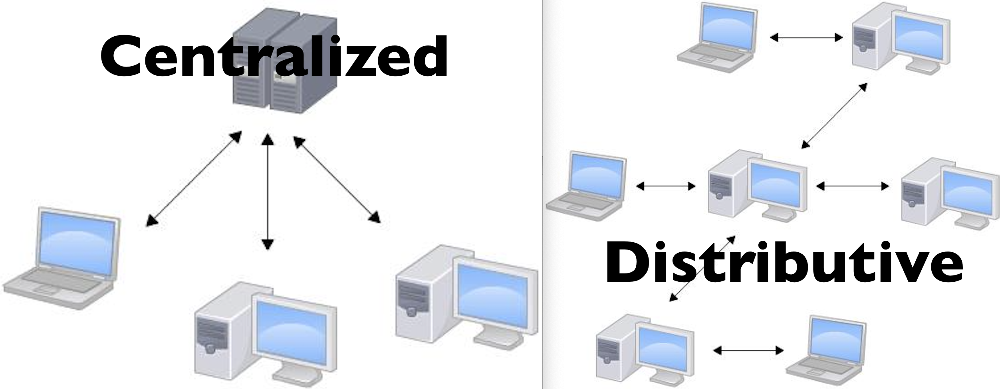

# How to use git

This note is about git using in group corporation.

Quick direction: [basic commands](#2.3 Basic Commands) and [commands](#3. Using Git)

Or you can directly see: [人能看懂的的版本](#4. Version for Human) 😂

## 1. Basic Knowledge

### 1.1 Background

Linux之父尤纳斯为了更好的管理他自己的开源项目linux系统而自己开发的一个软件，这个软件可以帮助Linux更好的进行开源开发，名字就叫Git。（Linus花了两周时间自己用C写完了Git，一个月之内，Linux系统的源码已经由Git管理了。）

### 1.2 Distributed version control system (分布式版本控制系统)

#### 1.2.1 Verision Control (“版本控制”的概念)

Saving all versions of a file, using certain structure of data, into the storage.


The most simple version control is saving copies of the files by yourself 😂 .

 At first there are **Local Version Control Systems** and then came centralized and then distributive.

In git, files that are tracked by git will be made a copy in a hidden `.git` folder. We'll talk about it [later](#About `.git` folder).

####1.2.2 Distributed and Centralized

Git is a distributed version control system (分布式版本控制系统). **Distributed** VS **Centralized**:



### 1.3 Supporting Operation System

Git supports Linux, macOS, and Windows.

On Linux and macOS, git can be directly called from Terminal.

On Windows, git can't be called from cmd.exe, but it provides a BASH emulation (that's **Git Bash**) used to run Git from the command line.

###1.4 Concepts In Git (git中的概念及原理)

Reference: [Introduction to Git Concepts](https://www.intertech.com/Blog/introduction-to-git-concepts/).


#### 1.4.1 Workspace (工作区)

It's a folder where all files can be tracked (but also can be not tracked) by git. 

Files stored in this folder can be seen, opened, and edited as normal files.

It's the folder under which you  called `git init`. And it will contain a hiding `.git` folder.

#### 1.4.2 Index and added files

#### 1.4.3 Local Repository (本地仓库) and commited files

It's a abstract concept, meaning a repository (仓库) where all the history versions are stored.

#### 1.4.4 Branch

#### 1.4.5 Reomote Repositories

#### 1.4.6 Tracking


####About `.git` folder

Reference: [how git version control functions](https://blog.csdn.net/wangbaolongaa/article/details/52039447).

In `.git` folder, file copies are actually saved as a compressed type, stored in folders in `.git\objects\`.

All information of this git repository, including staged files, committed files, remote repository location (generated by `git remote add xxx xxxx` command), is stored here (but global configurations like user name and user email address are not). Every repository has its won set of these kinds of information and this information is only for that repository.


## 2. Getting Started

### 2.1 Installation

略

### 2.2 Basic Settings

####2.2.1 Global Configuration (全局配置)

You need to set some "user information" before you use git. ( Some CSC teachers ignored it ?! )

```command
$ git config --global user.name "Your Name"
$ git config --global user.email "email@example.com"
```

After that, every record made on your computer will be recorded with your account.

Suggestion: use your github email and username even though it may not be necessary.

### 2.3 Basic Commands

#### 2.3.1 add

#### 2.3.2 commit

#### 2.3.3 remote

##### 2.3.3.1 remote add

#### 2.3.4 copy

#### 2.3.5 push

(以上全略，详见[3. Using Git](#3. Using Git))


## 3. Using Git

<<<<<<< HEAD

=======
### 3.1 Version control commands

####3.1.1 add

Add a file into "staged files".

Example:

```
$ git add filename.txt
```

Or if you are lazy, you can use `.` to represent "all files in the workspace":

```
$ git add .
```

Yes I'm lazy.

####3.1.2 stage

Same usage as `add`.

#### 3.1.3 commit

Commit all the changes (files). A commit action is to commit the added changes and save them as one "edit operation" (确认缓存区的所有的更改，整个存储为一次操作). The "edit operation" is called "a commit". The commit will be added to the end of the branch that you are in (这次 commit 会添加到继当前所处的分支的末端).

A discription of the commit should be added, called "commit log". Commit log can be seen when you are checking your commits on your computer, or on remote repository websites like GitHub.

Basical usage: 

```
$ git commit -m "this is a discription of this commit"
```

git commit -a -m “message”:

```
git commit -a -m “this is try to add and commit all tracked files”
```

Add all tracked files and commit. Not recommended because new-created files before last add  command will not be automatically added.

git commit --amend:

```
git commit --amend
```

This is a convenient way to modify the most recent commit. It lets you combine staged changes with the previous commit instead of creating an entirely new commit.

> It can also be used to simply edit the previous commit message without changing its snapshot.

###3.2 Reomote corporation commands

#### 3.2.1 remote

Directly use `git remote` will list all remote computer name (the name you made for it) :

```
$ git remote
origin
```

##### 3.2.1.1 remote -v

List all remote computer with its address.

```
$ git remote -v
origin  git@github.com:jquery/jquery.git (fetch)
origin  git@github.com:jquery/jquery.git (push)
```

##### 3.2.1.2 remote add (make a name for the remote) (remote location)

It's to add information of a new remote repository (remote computer).

Most of the time the central repository (though git is a distributive version control tool, we still need a central one to keep our code always online) is named "origin". But it's just a hobby.

```
$ git remote add origin git@github.com:jquery/jquery.git
```

##### 3.2.1.3 remote rm (remote name)

To remove a remote computer information from this repository.

##### 3.2.1.4 remote rename / remote show

```
$ git remote rename <previous name> <new name>
```

```
$ git remote shwo <name>
```

The `remote show` will list information of certain remote repository.

#### 3.2.2 clone

Clones a repository into a newly created directory, creates remote-tracking branches for each branch in the cloned repository. And creates and checks out an initial branch that is forked from the cloned repository’s currently active branch.

(将某个repo克隆至本地的新repo，远端repo中的每个分支都会在本地repo有相应的分支。自动将远端repo最近active的分支设为初始分支并切换至此。)

After the clone, a plain `git fetch` without arguments will update all the remote-tracking branches, and a `git pull` without arguments will in addition merge the remote master branch into the current master branch

(所有的分支都会保持tracking，也即是说可以直接不加参数地使用[fetch](#3.2.4 fetch)、pull、push等命令)

⚠️Note that the `git clone` operation doesn't require a git repository exist under current folder. And the new repo is created inside your current folder, witch means you shoud `cd` into the new folder to continue the following operations. 

(注意：`git clone` 指令不需在repo内执行，新的repo会在你当前的工作目录下生成，这时你需要 `cd` 到这个新repo中才能执行接下来的操作)

Example:

```
$ ls
there_is_nothing.txt
$ git clone git@github.com:CUHK-SZ-SC/mdnmd.git
Cloning into 'mdnmd'...
remote: Enumerating objects: 28, done.
remote: Counting objects: 100% (28/28), done.
remote: Compressing objects: 100% (21/21), done.
remote: Total 28 (delta 4), reused 28 (delta 4), pack-reused 0
Receiving objects: 100% (28/28), 1.04 MiB | 55.00 KiB/s, done.
Resolving deltas: 100% (4/4), done.
$ ls
mdnmd			there_is_nothing.txt
$ cd mdnmd
$ ls
Notes
$ git status
On branch master
Your branch is up to date with 'origin/master'.

nothing to commit, working tree clean
```

#### 3.2.3 push

Push your commits up to remote repositories.

#### 3.2.4 fetch

##### 3.2.4.1 fetch (remote name)

This will get all commits of a remote repository into local repository (but not influence workspace).

For example:

```
$ git fetch remote1
remote: Enumerating objects: 28, done.
remote: Counting objects: 100% (28/28), done.
remote: Compressing objects: 100% (21/21), done.
remote: Total 28 (delta 4), reused 28 (delta 4), pack-reused 0
Unpacking objects: 100% (28/28), done.
From github.com:CUHK-SZ-SC/mdnmd
 * [new branch]      master     -> remote1/master
```


####3.2.5 pull

###3.3 Branch control commands

#### 3.3.1 branch

As a basical command of branch control, it will list all branches in your repository.

Example:

```
$ git branch
* master
```

##### 3.3.1.1 branch (branch name)

It's to create a new branch

Excample:

```
$ git branch test
$ git branch
* master
  test
```

##### 3.3.1.2 branch -d (branchname)

```
$ branch -d test
Deleted branch test (was 77ddf50).
```

Delete a branch.

##### 3.3.1.3 branch -r / branch -a

A `-r` will help show branches from remote repositories.

```
$ git branch -r
  remote1/master
```

And a `-a` will show all the branches both local and remote.

```
$ git branch -a
* master
  test
  remotes/remote1/master
```


#### 3.3.2 checkout

It's to change the branch you are on.

Example:

```
$ git checkout test
Switched to branch 'test'
$ git branch
  master
* test
```

##### 3.3.2.1  checkout -b (branchname)

It's to creat a new branch and change onto it.

##### 3.3.2.2 checkout -b (branchname) (original beanch)

It's to create a new branch from an original branch. It's commenly used when 

####3.3.3 merge

(版本控制中最复杂的谜之操作？？)

Directly use of  `git merge` will be explained [later](#Git merge without branch name:).

#####3.3.3.1 git merge (branch name)

Example：

```
$ git merge test
Merge made by the 'recursive' strategy.
 2.py | 0
 1 files changed, 0 insertions(+), 0 deletions(-)
 create mode 100644 2.py
```

with log information:

```
$ git log --oneline
7f7f464 (HEAD -> master) Merge branch 'test'
675b84c (test) add 2.py
88428d8 create 1.py
```

the branch name can be both local or remote. If you just call `git merge`

###### Conflict when handling:

If there are conflicts when merging two branch,git will give `CONFLICT ... Automatic merge failed; fix conflicts and then commit the result.`. Then you should handle the conflict by your self. After handle, you should add and commit again, then git will automatically merge these two branches again and generate a new commit.

(如果在 merge 的时候遇到冲突(如一个 branch 中修改了某个文件，另一个 branch 却将其删除；或两个 branch 都对某个文件的同一行内容进行了不同的修改)，git 会报错。此时你需要手动修改解决两个版本的冲突。重新 add commit 之后，git 会自动重新 merge，并生成一次新的 commit )

Example:

```
$ git branch delete4
$ vim 4
$ git add .
$ git commit -m"edit 4"
[master de8651a] edit 4
 1 file changed, 1 insertion(+)
$ git checkout delete4
Switched to branch 'delete4'
$ rm 4
$ git add .
$ git commit -m "delete 4"
[delete4 546d240] delete 4
 1 file changed, 0 insertions(+), 0 deletions(-)
 delete mode 100644 4
$ git checkout master
Switched to branch 'master'
$ git merge delete4
CONFLICT (modify/delete): 4 deleted in delete4 and modified in HEAD. Version HEAD of 4 left in tree.
Automatic merge failed; fix conflicts and then commit the result.
$ rm 4
$ git add .
$ git commit
[master 8574519] Merge branch 'delete4'
$ git log --oneline
8574519 (HEAD -> master) Merge branch 'delete4'
546d240 (delete4) delete 4
de8651a edit 4
```


###### Git merge without branch name:

Directly a `git merge` will merge the **remote version of your current branch** into your current branch.

## 4. Version for Human （说人话的版本）

‼️偷懒警告‼️

本部分写给懒得看上面内容的人。

首先，还是建议你把[1. 一些背景知识](#1. Basic Knowledge)看一看。尤其是关于[git 中常见的概念](#1.4 Concepts In Git (git中的概念及原理))这一小部分。

使用git进行版本控制和远程协作的大多数情况，其实就是：**(可以忽略4.4)**

### 4.1 开始一个git仓库

#### 场景一：创建本地repo，推至远端空repo

1. 在你想作为workspace的文件夹下使用 git init。
2. add 和commit 这两个基本命令来把初始修改添加到本地repo里。
3. git remote add 添加一个远端仓库信息（remote repo）
4. `git push -u origin master`  or `git push --set-upstream origin master`, 然后信息就会被上传到远端仓库，并且本地的master分支会与远端仓库的master分支建立联系。

#### 场景二：参与某个已有的远端repo

1. 无需 init ，首先用 git clone + (remote address) 把整个远端repo拉到本地成为本地repo。此时cd到repo目录下，可以看到repo中已经 init 了 git 并有了一个自动命名为origin 的remote。详情请见[3.2.2 clone指令](#3.2.2 clone).

[不，我想学个更反人类的方法](#4.4.1 pull a remote repo into an empty local repo)，[或者超级反人类的方法](#4.4.1 pull a remote repo into an local repo with existing branches)

### 4.2 进行本地工作

1. add 和 commit 添加你的修改
2. checkout 操作在不同branch 间切换，merge 操作来进行branch之间的合并 ([这是什么鬼？！](3.3 Branch control commands))

### 4.3 将你的工作提交给远端

#### 场景一：其他人很懒，在你干活的时候什么都没干

1. git push
2. 上 bilibili 关注 @DL昊 和 @威利旺卡Des，并给他们素质三连

#### 场景二：remote 有了新 commit

1. git push 会提示你:

   ```
   To xxxxx
    ! [rejected]        master -> master (fetch first)
   error: failed to push some refs to 'xxxxx'
   hint: Updates were rejected because the remote contains work that you do
   hint: not have locally. This is usually caused by another repository pushing
   hint: to the same ref. You may want to first integrate the remote changes
   hint: (e.g., 'git pull ...') before pushing again.
   hint: See the 'Note about fast-forwards' in 'git push --help' for details.
   ```

   这就说明你的伙伴很勤勉，已经有了新的commit。[你还真是怠惰呢](https://www.bilibili.com/bangumi/play/ep307063?from=search&seid=4183321439332572774)，比伙伴落后了几个commit。

2. 这时你需要同步一下你和 remote 的内容, `fetch` + `merge` 或者直接一个 `pull` 都可以，例如：

   ```
   $ git pull
   ```

   不出意外的话给出的信息大概就是这样的：([woops, 我还真就出意外了怎么办](#场景三：你与远端的工作出现了冲突))

   ```
   remote: Enumerating objects: 11, done.
   remote: Counting objects: 100% (11/11), done.
   remote: Compressing objects: 100% (8/8), done.
   remote: Total 10 (delta 0), reused 10 (delta 0), pack-reused 0
   Unpacking objects: 100% (10/10), done.
   From xxxxxxxxxxxx
      76f5065..7dd2550  master     -> origin/master
   Updating 76f5065..7dd2550
   Fast-forward
    5   | 0
    aaa | 0
    2 files changed, 0 insertions(+), 0 deletions(-)
    create mode 100644 xxx
    create mode 100644 xxxxx
   ```

3. 现在你已经将同伴的工作整合进自己的工作了，可以正常push了

#### 场景三：与远端的工作出现了冲突

当pull或merge的时候出现了这样的报错，就说明出现了冲突：

```
CONFLICT (modify/delete): xxx deleted in a42d92ff95506b6daa349351cbdffe1c8d431812 and modified in HEAD. Version HEAD of xxxx left in tree.
Automatic merge failed; fix conflicts and then commit the result.
```

比如远端仓库有一篇没完成的GitTutorial，你在本地精心写完了它，然后push的时候发现呢的神奇队友已经在一次commit中把它给删了，这时就涉及到了冲突处理。[详见3.3.3.1 git merge: Conflict when handling](#Conflict when handling:).

根据报错的字面意思，我们去修改冲突的部分，然后重新add commit一下，就自动重新merge了(比如上述例子你就什么都不用改直接 add 和 commit)。之后就可以继续正常push了。

### 4.4 其他情况 

#### 4.4.1 pull a remote repo into an empty local repo

1. First you need to have a local repo: `git init`

2. Use `remote add` to add a remote info.

3. Use `fetch` to get all branches from remote. Now it's like:

   ```
   $ git branch -a
     remotes/origin/master
   ```

4. Use `checkout -b` to create a new branch which is up-tp-stream with original branch on remote.

   ```
   $ git checkout -b master origin/master
   Branch 'master' set up to track remote branch 'master' from 'origin'.
   Already on 'master'
   ```

   

#### 4.4.1 pull a remote repo into an local repo with existing branches

1. First you need to have a local repo with existing commits, to that you will have at least a master branch.

   now your repository should look like this:

   ```
   $ git branch -a
   * master
   ```

2. Use `remote add` to add a remote info.

3. Use `fetch` to get all branches from remote. Now it's like:

   ```
   $ git branch -a
   * master
     remotes/origin/master
   ```

4. `merge` them using `--allow-unrelated-histories`

   ```
   $ git merge origin/master --allow-unrelated-histories -m "merge local to origin"
   Merge made by the 'recursive' strategy.
    init | 0
    1 file changed, 0 insertions(+), 0 deletions(-)
    create mode 100644 init
   ```

5. set your branch up to stream

   ```
   $ git branch --set-upstream-to=origin/master master
   Branch 'master' set up to track remote branch 'master' from 'origin'.
   ```

   

